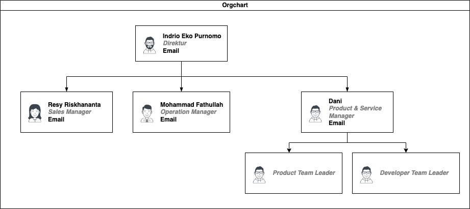

# 💻 Front-End Mobile Development 💻

**Hexa Digital Solusindo**
Shekinah Yeshammah Immanuel Nelwan
XI RPL
NIK: 212210036

---

## Profil *(singkat)* Perusahaan

---

**Hexa Digital Solusindo** adalah perusahaan *Start-up Software Development* yang didirikan pada tahun 2017.

perusahaan yang bekerja dalam bidang *Software Development*, bertugas untuk menyelesaikan permasalahan apapun yang klien butuhkan dengan solusi digital.

---

## Struktur Organisai

---
## Flowchart Mobile Developer

---

## Proses Realisasi Design Pada Kode Aplikasi

---

Sebelum membuat desain front-end dan masuk ke tugas utama kita sebagai developer ini, kita juga mempunyai tugas utama dengan developer lainnya agar aplikasi ini bekerja dengan baik, diantaranya :

1. **DISKUSI DENGAN TIM DESAIN**
2. **MEMASUKKAN KODE YANG DIBUTUHKAN**
3. **MEMONITOR SITUS DAN PENGGUNAANNYA**

---

Berikut adalah step by step proses pekerjaan saya sebagai front-end developer untuk merealisasikan design pada kode :

1. Pertama mari kita lihat design yang akan kita kerjakan. Berikut adalah layar login yang sudah dibuat oleh designer yang kita akan realisasikan.

---

---

2. Sebelum kita bisa mengerjakan apapun dalam kode, kita harus deconstruct design yang kita dapatkan pada esensi-esensi mereka tersendiri untuk mempermudahkan pekerjaan kita.

---

---

3. Setelah itu, baru kita bisa mengerjakan design pada kode. Pertama mari kita memastikan background image layarnya tetap berada dibelakang form login dan tidak menindih elemen-elemen apapun. Untuk melakukan ini kita akan menggunakan function stack  untuk mencapai effect seperti berikut:

---

---

4. Untuk menggunakan function stack pada kode, berikut adalah caranya : 

---

5. Dengan itu, kita bisa menggunakan pengetahuan sebelumnya untuk merealisasikan design kita, pertama kita pakai function stack

---

6. setelah itu masukan logo pada dalam child function stack

---

7. seterusnya password form

---

8. dan akhirnya button login

---

9. Setelah itu semua sudah, kita harus membuat flutter tau dimana file-file asset kita tersimpan dengan memasuki file pubspec.yaml

---

## Hasil Kegiatan

---

