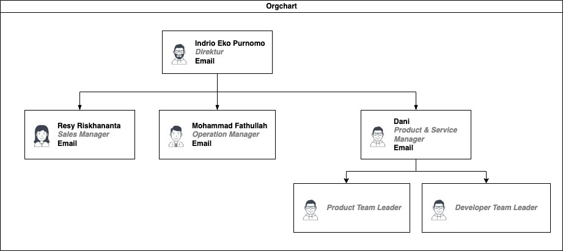

# Back-End Mobile Development 🤖

PT. Hexa Digital Solusindo

---

## 🏢 Profil Perusahaan 🏢

---

<!-- Hexa Digital Solusindo adalah perusahaan Start-up Software Development yang didirikan pada tahun 2017 -->

<!-- Hexa adalah perusahaan yang bekerja dalam bidang Software Development -->

---

### The Hexagonal Principle

* Listen 👂
* Research 🔬
* Plan 🗓️
  
* Development 🧑‍💻
* Adjustment 🎚️

<!--Listen : Hexa menegaskan pentingnya komunikasi antara klien dengan developer. Untuk mewujudkan hasil yang paling sesuai dengan kebutuhan, mau secara spesifikasi ataupun fungsi.-->

<!--Research : Hexa selalu melakukan riset menyeluruh akan semua permasalahan yang klien butuhkan untuk menciptakan solusi yang paling efektif dan efisien-->

<!--Plan : Rencana yang komprehensif dan tepat akan menjaminkan hasil solusi yang dibutuhkan konsisten dengan ekspektasi professional kepada klien dan sesuai dengan kebutuhan.-->

<!--Development : Fase development atau perancangan memulai mengimplementasikan rencana yang sudah disetujui oleh developer dengan klien, dimana progress akan selalu transparant dengan klien.-->

<!--Adjustment : Saat development sudah hampir selesai, developer dan klien akan menyesuaikan solusi sesuai dengan komunikasi antara developer dan klien yang memenuhi kebutuhan.-->

---
<!--_color: red-->
# <!--fit--> Launch 🚀

<!--Launch : Saat semua penyesuaian dan development sudah selesai, dengan slogan mereka "Test it, break it.". Untuk memastikan kehandalan solusi akan selalu bekerja, Hexa menganjurkan kepada kliennya untuk mencari kesalahan atau bug apapun yang ada pada solusi, untuk menghasilkan solusi yang paling efektif dan praktis untuk permasalahan apapun.-->

---

### **Visi** dan **Misi**

---

Visi **Hexa** adalah untuk menciptakan proses development solusi digital pada permasalahan masyarakat di semua bidang yang effektif dengan memegang pada 6 prinsip Hexa.

---

Misi **Hexa** adalah untuk membuat proses development solusi software dalam semua industry menjadi lebih mudah dan efektif untuk penyelesaian masalah apapu yang klien butuhkan.

---

### Struktur Organisasi

---

## Definisi Back-End Mobile Development

---
### **Back-End** Mobile Development

<!--Back End Mobile Development dibagi menjadi 2 aspect :
1. Back-End
2. Mobile
-->

<!--Back End : back-end adalah pembuatan sistem software, design architecture sistem, API, dan penanganan data yang effisien dan aman.-->
<!--Mobile Development : Mobile Development adalah pembuatan software-software pada perangkat mobile, walau pada umumnya pada perangkat handphone, Mobile development juga mencakup perangkat mobile apapun seperti tablet kasir, assistant digital, dll.-->

<!--Back-end Mobile Development bertujuan untuk membuat sistem yang terintegrasi dengan front-end software, dimana semua fitur-fitur terintegrasi dengan benar dengan keseluruhan software. Tujuan Idealnya, kerja back-end yang bagus adalah dimana user tidak terpikir sama sekali pekerjaan back-end developer. -->

---

## Proses Back-End Mobile Development

