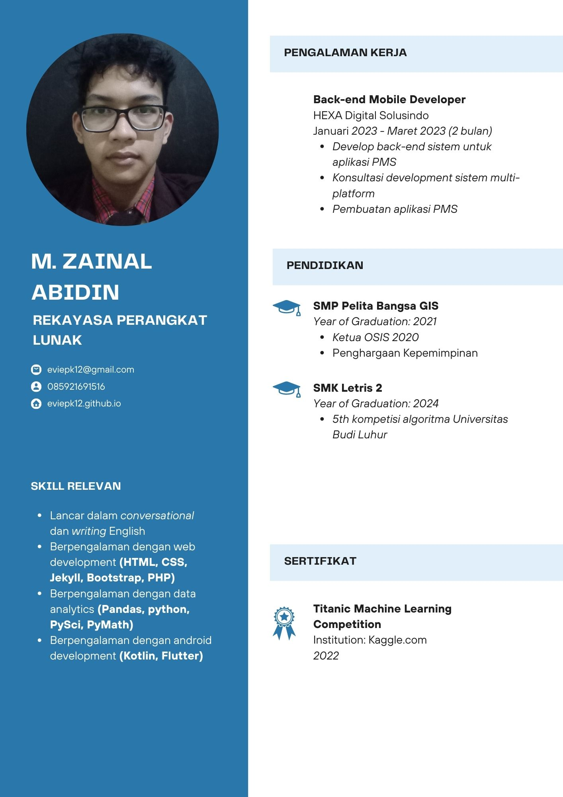
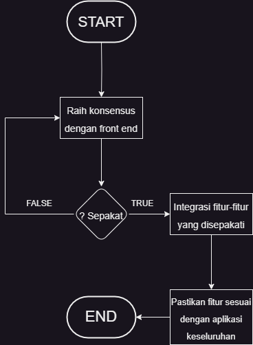
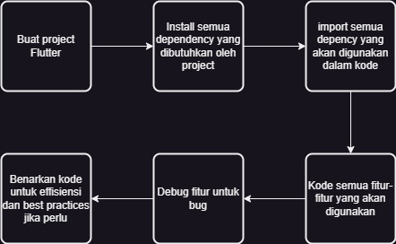
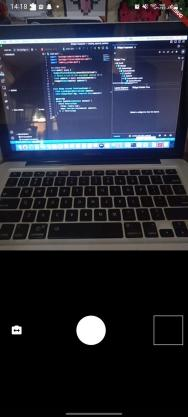

<!---
Selamat pagi, kepada bapak dan ibu pembimbing yang terhormat
video ini saya ingin mempresentasikan pengalaman prakerin saya selama 2 bulan di Pt. Hexa Digital Solusindo
nama saya Muhammad Zainal Abidin
Nomor induk saya 212210030
di jurusan Rekayasa perangkat lunak

Dan Dalam menyelesaikan laporan ini, saya telah menerima banyak dukungan dan bimbingan dan banyak pihak. Oleh karena itu saya mengucapkan terima kasih yang sebesar besarnya kepada:

Bapak kepala sekolah Bapak Ahmad Maulana Alamsyah M.Kom , M.Os,
- 2. Kaprodi Pak Nurdin S.Kom
- 3. Walikelas Bu Marsya Naqiya Azzahra
- 4. Pembimbing DuDi Pak Indri Eko Purnomo
- 5. Orang tua kalian
- 6. Dan semua Guru guru di SMK LETRIS INDONESIA2.
-->

---

# Back-End Mobile Development 🤖

PT. Hexa Digital Solusindo

<!--Tugas atau pekerjaan saya prakerin saya adalah sebagai back-end mobile development-->
---

## 🏢 Profil Perusahaan 🏢

---

<!-- Hexa Digital Solusindo adalah perusahaan Start-up Software Development yang didirikan pada tahun 2017 -->

<!-- Hexa adalah perusahaan yang bekerja dalam bidang Software Development -->

---

### **Visi** dan **Misi**

---

Visi **Hexa** adalah untuk menciptakan proses development solusi digital pada permasalahan masyarakat di semua bidang yang effektif dengan memegang pada 6 prinsip Hexa.

---

Misi **Hexa** adalah untuk membuat proses development solusi software dalam semua industry menjadi lebih mudah dan efektif untuk penyelesaian masalah apapu yang klien butuhkan.

---

### Struktur Organisasi

---

## Definisi Back-End Mobile Development

---
### **Back-End** Mobile Development

<!--Back End Mobile Development dibagi menjadi 2 aspect :
1. Back-End
2. Mobile
-->

<!--Back End : back-end adalah pembuatan sistem software, design architecture sistem, API, dan penanganan data yang effisien dan aman.-->
<!--Mobile Development : Mobile Development adalah pembuatan software-software pada perangkat mobile, walau pada umumnya pada perangkat handphone, Mobile development juga mencakup perangkat mobile apapun seperti tablet kasir, assistant digital, dll.-->

<!--Back-end Mobile Development bertujuan untuk membuat sistem yang terintegrasi dengan front-end software, dimana semua fitur-fitur terintegrasi dengan benar dengan keseluruhan software. Tujuan Idealnya, kerja back-end yang bagus adalah dimana user tidak terpikir sama sekali pekerjaan back-end developer. -->

---

## Proses Back-End Mobile Development

---

<!--Pada project ini, kami menggunakan Multi-Platform framework bernama Flutter, walau kami tidak akan menggunakan semua platform yang disupport oleh flutter karena kami berfokus pada mobile development. 
-->

---

---

---

## Hasil Kegiatan

---

<!--Terimakasih atas perhatiannya sudah mengikuti presentasi saya mengenai back-end mobile development.
 Jika ada kekurangan dalam penyajian presentasi ini saya ucapkan mohon maaf. Sekian terima kasih.
-->